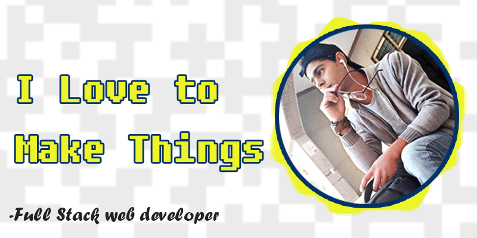

### Hey there
 * 👨 My name is __Ahmad Fathy__, I am from Egypt and I am 23 years old.
 * 💻 I am a full stack web developer using __JavaScript__ in almost all of my works.
 * 🔎 I am looking for job opportunity.

### my skills
Html, Css, JS, JQuery, Bootstrap, Ajax, Vue.js, Vuex, Pug, Ejs, Sass, Node.js, Express, MongoDB, mongoose, Git/Github.
##### i also have some experience with
Nuxt.js, Canvas, SVG, Three.js, P5.js, React.
##### and I am familiar with
Php, MySQL, Electron, NativeScript, C++, VisualBasic.
##### I am trying to learn now
GraphQL.

### Achievements
__July 2020:__ I graduated from specific education college and I got the __first__ place in my department (educational technology department) 🎉🎉 and the __second__ place in my college 🎉🎉 with GPA: 3.675. And I got an A+ in my graduation project __[ICC(Internal Computer Components)](https://ahmadfathy97.github.io/icc 'ICC')__.

### Contact Info
ahmadfathydev@gmail.com
[twitter](https://twitter.com/ahmad_fathy97)\
[linkedin](https://www.linkedin.com/in/ahmadfathy97/)\
[facebook](https://www.facebook.com/AhmadFathy97/)\
[Ahmad Fathy](https://ahmadfathy.netlify.app/)

> My pc is my friend I talk to him a lot, sometimes beautiful things are produced from our talks.
